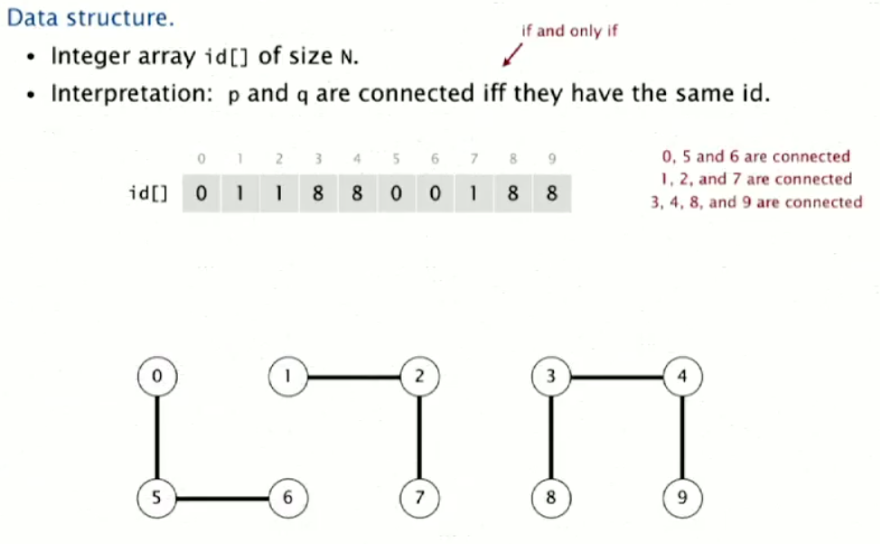

# 1.1 Quick Find

Now we'll look at the quick find algorithm. This is an example of the eager approach to algorithm design.

Our data structure will be an Integer array `id[]` of size n, where items are deemed connected if they have the same id. E.g. For a problem with connected sets {0}, {1 4}, {2 3}, we might have an array like: [0 4 2 2 4]. Another example is shown in the image below.



## Operations

There are 3 main operations we need our data structure to support, find, union and the initialization of the data structure.

**Initialising** the array is easy, just make every item's id equal to its index.

**Find** is also easy to implement, just check if the ids of two items are the same.

**Union** is more difficult, as we need to go through the array to update all the array items that share an index to the new single index. We'll see shortly that this is going to cause us to have a high time complexity.

## Example Implementation

```Java
public class QuickFindUF
{
  private int[] id;
  
  public QuickFindUF(int N)
  {
    id = new int[N];
    for (int i = 0; i<N; i++)
      id[i] = i;
  }
  
  public boolean find(int p, int q) 
  {
    return id[p] == id[q];  
  }
  
  public void union(int p, int q)
  {
    int targetId = id[p];
    int locationId = id[q];
    for (int i = 0; i < id.length; i++)
    {
      if(id[i] == locationId)
        id[i] = targetId;
    }
  }
}
```

## Efficiency

How efficient is this algorithm? Both initializing and the union operation are time complexity N. Find has constant complexity. Thus, if you have to apply N unions to N objects, you have quadratic (N^2) time complexity. We'll see over the course that quadratic complexity is just too slow. It doesn't scale. Thus, to summarise:

* **Initializing** - O(N)
* **Find** - O(1)
* **Union** - O(N)