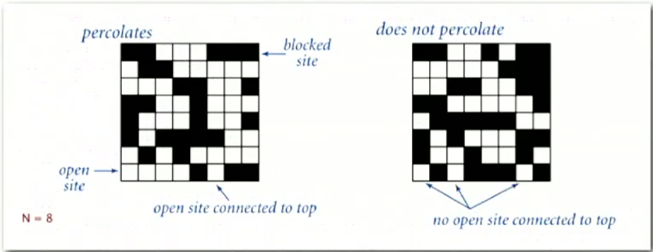
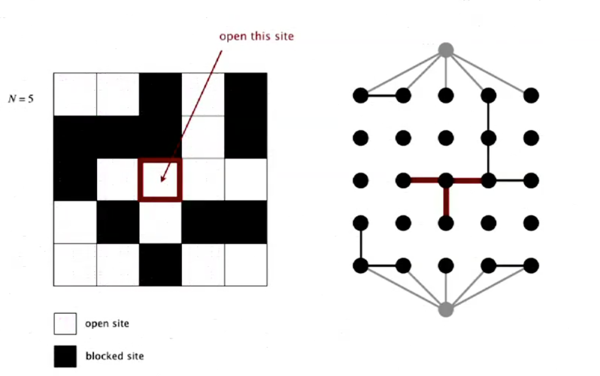
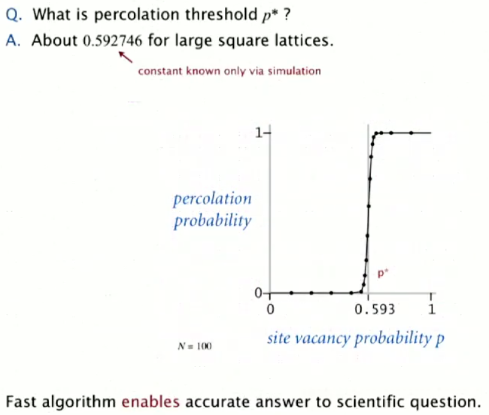

# 1.4 Union Find Applications

There are many applications of this algorithm. These include:
* Games (Go, Hex)
* Least Common Ancestor
* Hoshen-Kopelman algorithm in physics
* Kruskal's minimum spanning tree algorithm
* Image Processing in Matlab
* Compiling Equivalence statements in Matlab.

The one we're going to focus on here is a problem called percolation.

## Percolation

This is a model for many physical systems.

* Imagine you have a square grid of size N by N
* Each site is open with probability p (and thus, is blocked with probability 1-p)
* The system **percolates** if and only if the top and bottom rows are connected by open sites.

This is a suitable model for a variety of systems, including electrical conduction, water flowing through a porous system, or a social network in which you're looking for connections between groups of people.

### Problem Description

The likelihood of percolation depends on probability `p`.

What we're looking for here is the **percolation phase transition**. For a suitably large N, theory guarantees that we'll have a sharp threshold for the transition of `p*`. We want to determine p*.

This is a good example of a system that is well detailed, but has no analytical solution, it only has computational ones.

### Methodology

Our methodoloy is what's known as the Monte-Carlo simulation. The process is:
* Initialise a N-by-N grid which is entirely blocked
* Declare random sites open until top is connected to bottom.
* The vacancy percentage estimates p*

We then run this experiment millions of time to determine p*.

### Determining percolation.

How do we determine if our system percolates? This is an example of our union-find algorithm:

1. We'll create an object for each site with indices between 0 and N^2-1.
2. Sites are in the same (connected) component if they are connected by open sites.
3. Our system percolates iff any site on the bottom row connects with any site on the top row. 

Unfortunately, the simplest implementation of step (3) above has an immediate time complexity of N^2 (because we have to compare each bottom site against every top site or vice versa).

More effective is to create two virtual sites, one on the top which is connected to the entire top row, and one on the bottom which is connected to the entire bottom row, and see if the virtual sites are connected.

To actually model the connected sites, whenever we open up a site, we'll connect it to any open sites that are adjacent to it. This is both intuitive, and should be easy to implement.

### Results

Implementing the approach outlined above and actually working through the maths, we find that the probability `p* = 0.592746`

