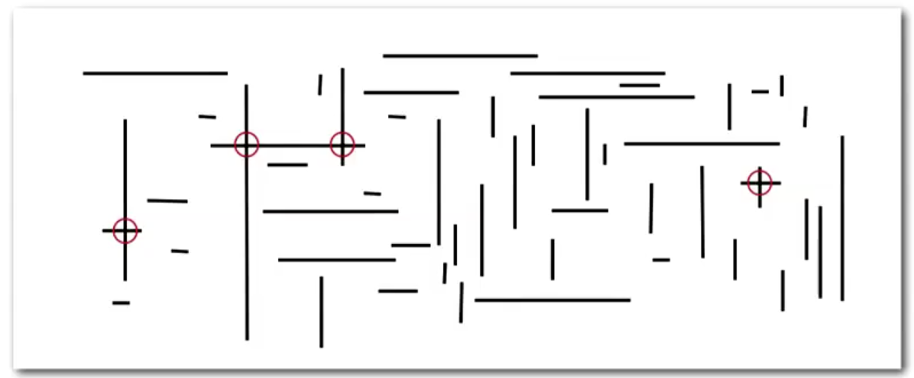
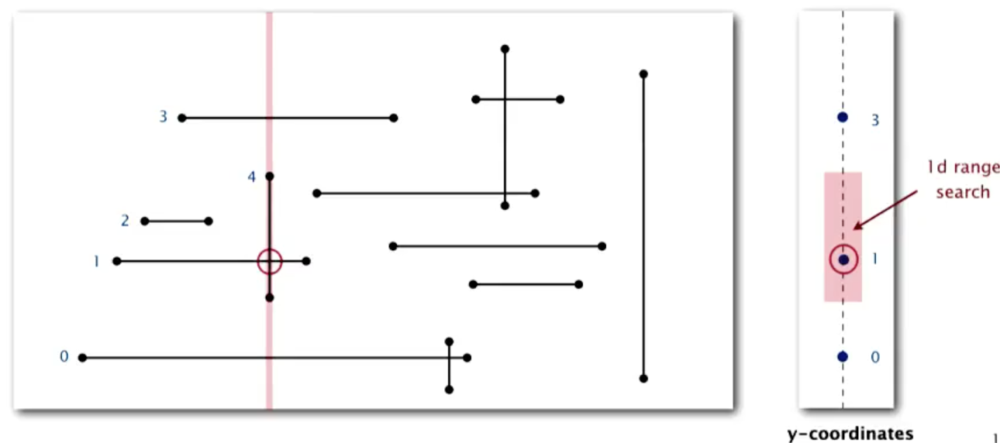

# 10.1 Line Segment Intersection

Now, we'll look at a simple geometric data processing problem called **orthogonal line segment intersection search**. This problem can be stated as:

> Given `N` horizontal and vertical line segments, find all intersections.

In the image below, there are 4.

The brute force algorithm to this problem is to check all pairs of line segments, which takes quadratic time. We'll aim to improve on this.

Note that for simplicity's sake, when we're solving the problem from this point on, we'll be assuming that all x-coordinates and y-coordinates are distinct. This is called the **Nondegeneracy assumption**

## Sweep-line algorithm

To solve this problem, we'll use the sweep-line algorithm. Conceptually, you can think of this algorithm as sweeping a vertical line from left to right over the problem space. To do this, we can either put the x-coordinates in a priority queue, or just sort them.

The x-coordinates then define the *events* of our algorithm. There are 3 possible events with corresponding actions:
1. We hit the *left* endpoint of a *horizontal* segment. In this case, we insert that segment's y-coordinate into a BST. Conceptually, that means we are currently investigating that segment.
2. We hit the *right* endpoint of a *horizontal* segment. In this case, we remove the segment's y-coordinate from the BST. We're done processing it.
3. We hit a *vertical* line segment. In this case, we do a range search for intervals of its y-endpoints. Any matches correspond to an intersection which we store.

Again, it's easy to see that the running time of this algorithm when there are `R` intersections and `N` orthogonal line segmenrs will be `NlogN + R`. The operations are:
* Put the x-coordinates on a PQ(or sort) - `N log N`
* Insert y-coordinates into BST - `N log N`
* Delete y-coordinates from BST = `N log N`
* Range searches in BST - `N log N + R`

Essentially, what this algorithm does is reduce a 2D orthogonal search into a 1D range search. 