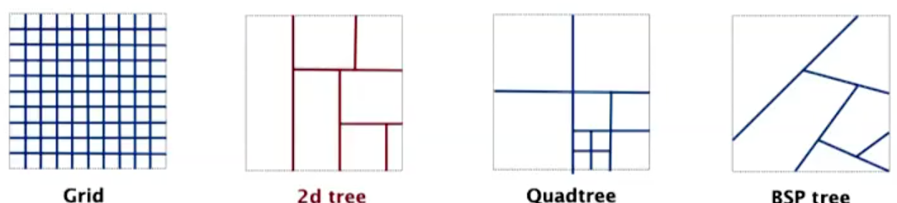
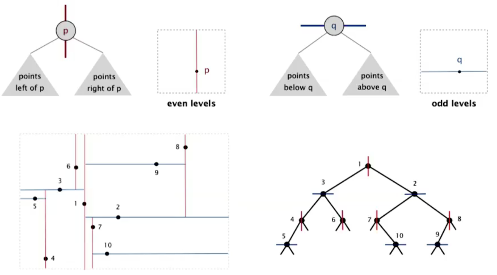
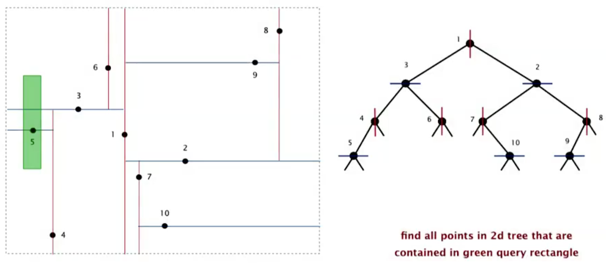
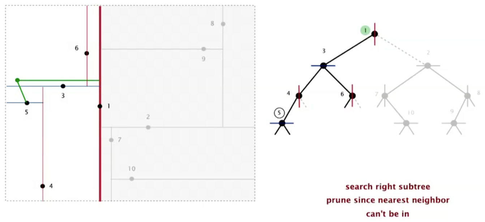
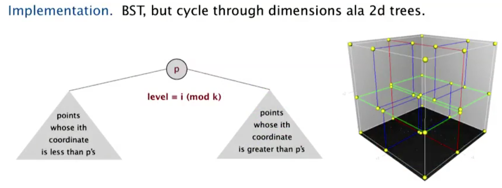

# 10.2 - KD-Trees

In this note, we'll be looking at Kd-trees, an extension of BSTs that allow us to efficiently process points in space.

## 2D Orthogonal Range Search

To start with, we'll be extend the API of our ordered symbol table to include 2D keys. This means:
* Inserting a 2D key
* Deleting a 2D key (which we'll ignore)
* Searching for a 2D key
* **Range search** - Finding all keys that lie in a 2D range
* **Range count** - The number of keys that lie in a 2D range

The geometric interpretation of this data structure is that:
* Keys are points in a plane
* Find/count the points in a given horizontal-vertical rectangle

Other applications include networking, circuit design and databases.

## Potential Implementation - Grid

One potential implementation is to divide the space into an `M`-by-`M` grid of squares. In this model:
* Create a list of points contained in each square
* Use a 2D array to directly index the relevant square
* Insert: add `(x,y)` to list for corresponding square
* Range Search: examine only squares that intersect 2D range query

In this implementation, you have a space-time trade-off. The code is:
* **Space:** `M^2 + N`
* **Time:** `1 + N/M^2` per square examined on average

so the larger your `M` value, the more space your query will take, but the less time. The rule of thumb for this is to have `M ~ sqrt(N)`. In this case, your time complexity simplifies down to:

* Initialize data structure: `N`
* Insert point: `1`
* Range search: `1` per point in range

as long as the points are **evenly distributed**.

Therein lies the rub with this particular implementation. **Clustering** is a well-known phenomenon in geometric data. And when your data is clustered, the lists are too long, even though the average length is short. Thus, what we really need is a data structure that adapts gracefully to our data.

(As an example of clustering, consider cities in the US. In rural areas, you'll have almost no data points. In coastal and urban areas, way higher. Hence inefficient.)

## Space-partitioning trees

To resolve this problem, what we'll do is use a tree to represent a recursive sub-division of 2D space. There are many kinds of trees that could be used here including the following (the grid has also been included for comparison):

* **Grid** - Divide space uniformly into squares
* **2D tree** - Recursively divide space into two half-planes
* **Quadtree** - Recursively divide space into four quadrants
* **BSP Tree** - Recursively divide space into two regions

The applications of these trees is vast. Some include:
* Ray tracing
* 2D range search
* Flight simulators 
* N-body simulation
* Collision detection
* Astronomical databases
* Nearest neighbour search
* Adaptive mesh generation
* Accelerate rendering in Doom
* Hidden surface removal and shadow casting

We're going to look at a 2D tree

## 2D Tree Construction

To reiterate, this data structure recursively partitions the plane into two halfplanes. How does it do this? Well, every time we add a point to the plane, we'll represent this in our data structure by adding it to a tree.

The first point's coordinates will be used to divide the tree into two horizontal halfplanes, s.t. when we add the second point to the tree, if it is to the left of `1`, it becomes its left child, and if it is to the right of `1`, it is its right child.

Point `2` again divides its subsection, but now it divides it into vertical subplanes. So if you add a point below `2` (and let's say to the right of `1`), it becomes `2`'s left child. If you add it above `2`, it become's `2`'s right child. And `3` again recursively splits the plane.

So our data structure then is a simple BST, but which alternates using *x* and *y*-coordinates as keys.
* Search gives the rectangle containing a point
* Insert further subdivides the plane

The only difference between the code for this and the code for a BST is the changing of the search coordinate at different levels.

## Range Search in a 2D Tree

We express range search in a 2D tree by searching for all the points in a queys axis-aligned rectangle. The algorithm is functionally almost identical to the 1D range search:

1. Check if the point in the node lies in the given rectangle
2. Recursively search left/bottom (if any could fall in rectangle)
3. Recursively search right/top (af any could lie in rectangle)

### Performance

In a typical case, we'd only have to perform a constant number of searches in the tree, so our complexity would be `R + log N`

In the worst case, (assuming the tree is balanced), the performance is `R + sqrt(N)`.

Performing this analysis is beyond the scope of this analysis

## Nearest Neighbour search in a 2D tree

How about solving the problem of finding the nearest neighbour to an arbitrary query point?

Again, our algorithm is remarkably similar to a normal search:

1. Check the distance from point in node to query point
2. Recursively search left/bottom if it could contain a closer point
3. Recursively search right/top if it could contain a closer point
4. Organize method so that it begins by moving towards the query point rather than away. This will help prevent unnecessary comparisons happening when you handle quadrants that are less likely to contain a closer point

### Performance

Again, in a typical case, this algorithm will have logarithmic time efficiency.

It is possible to generate worst-case scenarios with O(N) efficiency (e.g. all your points are in a circle and you search for the nearest neighbour of the center of the circle), but in general this is unlikely.

## Flocking Birds

As an aside, we'll look at the "natural algorithm" that corresponds to the movement of starlings. It turns out that the complex behaviour can be modelled using 3 simple rules. (As the original research paper did, we will refer to the units that are flocking as boids):

* **Collision avoidance** - point away from the *k nearest* boids
* **Flock centering** - point towards the center of mass of *k nearest* boids
* **Velocity matching** - update velocity to the average of the k nearest boids

Modelling the geometric behaviour of boids can be done quite simply using a 2D tree

## KD tree

It turns out that we can easily generalise our 2D trees to handle an arbitrary number `K` of dimensions. The only difference is that instead of recursibvely partioning our tree using 2 dimentions (first point splits horizontally, second splits vertically etc), we recursively partition k-dimension space into 2 halfspaces.

This data structure is simple, efficient, widely-used, and adapts well to high-dimensional and clustered data. To top it off, it was discovered by an undergrad in an algorithms class.

## N-body simulation

Consider the problem of simulating the motion of N particles, mutually affected by gravity. The brute force solution is to calculate the force (Newton's law of gravitation) for each pair of particles. This is prohibitively expensive `O(N^2)`.

To solve this, another undergraduate in an algorithms class came up with the Appel algorithm. The key idea:

> If a particle is far, far away from a cluster of particles, then youc an treat the cluster or particles as a single aggregate particle. Then, all you need to do is compute the force between the particle and the center of mass of the aggregate.
 
This algorithm is based on the idea of 3D trees. To implement it:

* Build a 3D-tree with `N` particles as nodes
* Store the center of mass of each subtree in each node
* To compute the total force acting on a particle, traverse the tree, but stop as soon as the distance from the particle to a subdivision is sufficiently large

This makes an `O(N^2)` operation more like `O(NlogN)`