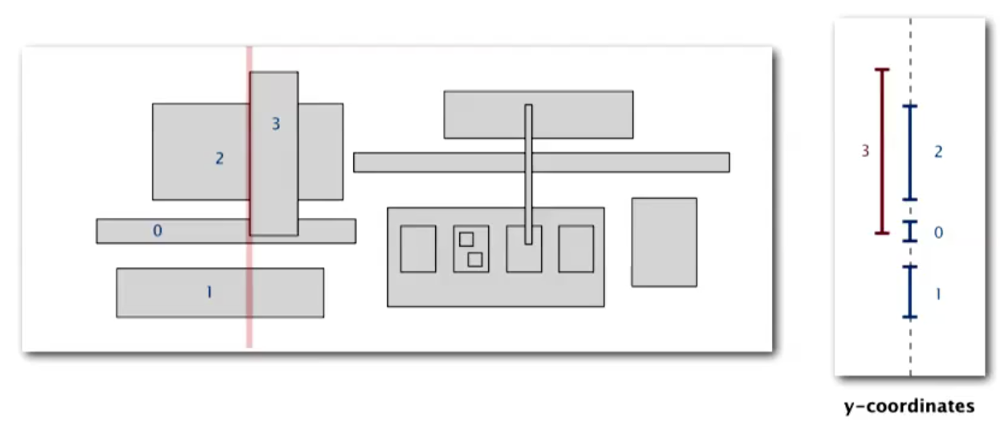
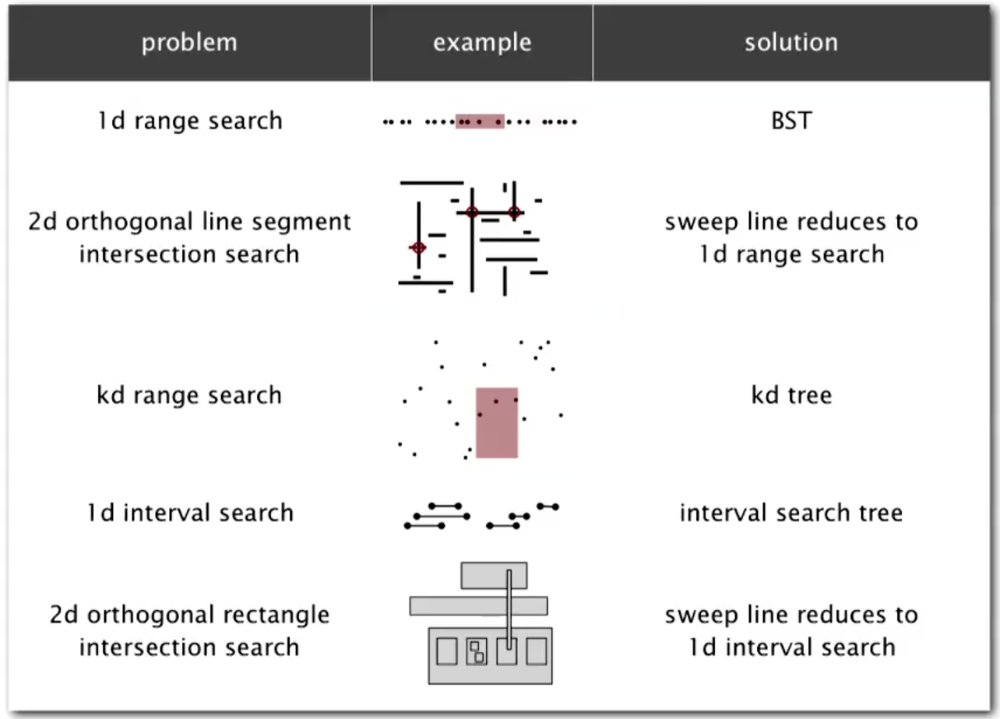

# 10.4 - Rectangle Intersection Problem

Finally, we'll look at the rectangle intersection problem, a natural extension of our earlier line intersection problem.

The goal of this problem is to:

> Find all intersections among a set of `N` orthogonal rectangles.

Once again, for simplicity we'll make the non-degeneracy assumption that all x and y coordinates are distinct.

The brute force solution to this problem is simply to compare all pairs of rectangles, which leads to a quadratic runtime. Using everything we've learned so far, it should be clear that we can do better.

## Application - Microprocessor Design

This problem has a wide range of applications. One of the most fascinating actually relates to microprocessor design. In the 1970s, with the rise of microprocessors, the process of designing a computer went form manually wiring it up yourself, to essentially making a giant drawing of how this very small circuit should be built and then handing it off to a machine to actually make the computer itself.

However, there were a large number of rules surrounding the design of a microprocessor, for instance:
* Certain wires cannot intersect
* Certain spacing is needed between different types of wires
* etc.

Because introducing a bug into a microprocessor quickly became very expensive, we needed algorithms to solve the rectangle intersection problem in-order to debug and guarantee the behaviour of our chips.

This process of microprocessor design however, meant that each generation's computers were being tasked with building the next generation of computers, which were often much more complex. Thus, by Moore's law, every year and a hald, computers with twice the speed would need to check double the number of components.

With the brute force, quadratic algorithm, you could not sustain Moore's law. So an efficient (linearithmic) solution to this problem was actually necessary to maintain Moore's law, and hence the explosive increase in computer power we've seen.

## Orthogonal Rectangle Intersection Search - Sweep-line algorithm

In an analagous way to how we solved this version of the problem for 1D lines, we can imagine sweeping a vertical line from left to right along the plane. Then:
* x-coordinates of left and right endpoints define events
* Maintain a set or rectangles that intersect the sweep line in an interval search tree (using the y-intervals of the rectangle)
* Left endpoint: intercal search for y-interval of rectangle. Insert y-interval
* Right endpoint:  remove y-interval.

## Analysis

We can prove that this algorithm takes time proportional to `N log N + R log N` to find `R` intersections among a set of `N` rectangles.

Each of the individual operations takes:
* Put x-coordinates on a PQ (or sort) - `N log N`
* Insert y-intervals into ST - `N log N`
* Delete y-intervals from ST - `N log N`
* Interval searches for y-intervals - `N log N + R log N`

## Summary

