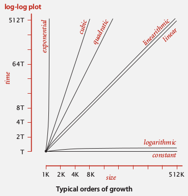

# 2.3 - Order of Growth Classifications

In practice, when we analyze algorithms, there are usually only a few functions that arise, and so we can classify our algorithms in one of only a few orders of growth. They are:

* **Constant**: O(1) - a statement e.g. an addition
* **Logarithmic**: O(lgN) - divide in half e.g. a binary search
* **Linear**: O(N) - loop e.g. find the maximum
* **Linearithmic**: O(NlgN) - divide and conquer e.g. mergesort, quicksort
* **Quadratic**: O(N^2) - double loop e.g. check all pairs
* **Cubic**: O(N^3) - triple loop e.g. check all triples
* **Exponential**: O(2^N) - exhaustive search e.g. check all subsets
* **Factorial**: O(N!) - e.g. generate all permutations of a list



The practical implications of these order of growth calculations is that we need our algorithms to be linear or linearithmic to keep up with Moore's law. Anything more complex, and our input data sets become severely size limited (going from 10^8 -> 10^4 and less).

## Binary Search

An example of this stuff in action is the binary search algorithm, which is formulated as follows:

**Goal** - Given a sorted array and a key, find the index of the key in the array

**Algorithm**
1. Compare the key against the middle entry
2. If key<item, go left. If key>item go right. If key == item, terminate
3. Repeat til you have found the item, or proven it is not in the array.

Because you are effectively halving the array with each operation, this algorithm has (time) complexity O(lg N).

Note that despite this algorithm's apparent simplicity, it is notoriously tricky to get right. The following is a simple, non-recursive implementation (though clearly, from the description, we could implement it recursively, for instance by reducing the size of the array).

```Java
public static int binarySearch(int[] a, int key) {
  int lo = 0, hi = a.length - 1;
  while (lo != hi) {
    int mid = lo + (hi - lo) / 2;
    if      (key < a[mid]) hi = a[mid - 1];
    else if (key > a[mid]) lo = a[mid + 1];
    else return mid;
  }
  return -1;
}
```

## 3-Sum

What does this mean for our 3-sum? Well, we can use this sorting-based algorithmic knowledge to help us. To start with, we can sort our array of numbers (an O(NlgN) operation). Then, for each pair of items in the array, we can perform a binary search for the third term (= - (a[i] + a[j]) ). This gives us an **O(N^2 lgN)** algorithm. Indeed, we could have an N^2 search and not affect the fundamental time complexity of the operation. Even so, this is certainly an improvement, which experiments bear out.
