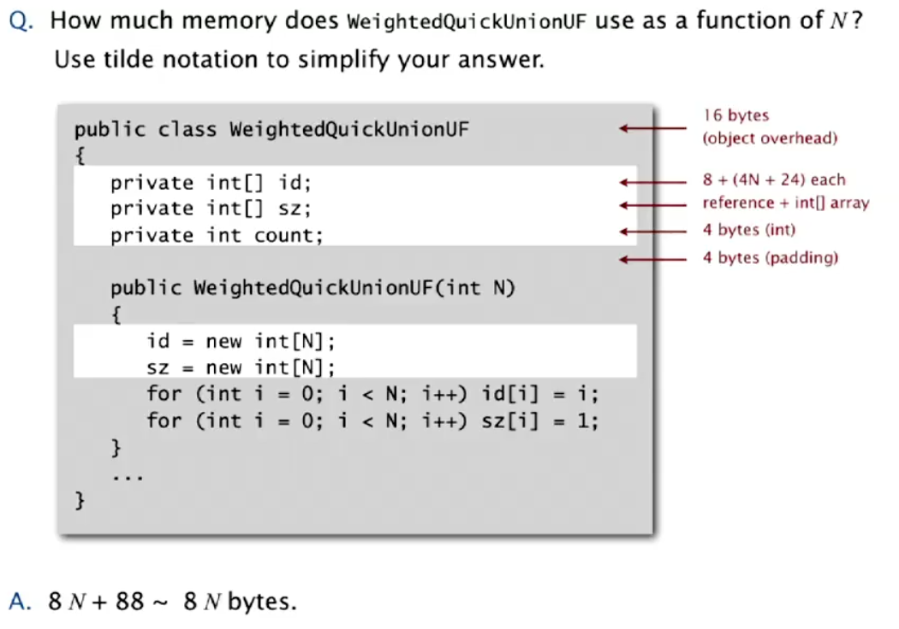

# 2.5 - Memory

So far, we've been talking about time, but we are also interested in the number of bits and bytes our program uses. To review:
* a **bit** is a 0 or a 1
* a **byte** is 8 bits
* a **megabyte** can mean either a million bytes or 2^20 (1,048,576) bytes. For computer scientists, the latter definition is preferred, so we will use it.
* a **gigabyte** as above, can be either a billion or 2^30 (1,073,741,824) bytes. We will use the latter.

Modern machines are mostly now **64-bit** with **8-byte** pointers. The transition to this, from 32-bit machines has been a long and painful one, as programs became larger than they "needed" to be. Thankfully, we're unlikely to have to repeat it anytime soon. 2^64 is roughly 10^19, which is a ludicrously large number.

## Typical Memory Usage for Primitive Types

* Boolean - 1 byte
* Character - 2 bytes
* Int - 4 bytes
* Float - 4 bytes
* Long - 8 bytes
* Double - 8 bytes

(1-D) Arrays have an overhead, in addition to what they're storing. So for example:

* char[] - 2N + 24
* int[] - 4N + 24
* double[] - 8N + 24

For 2-D arrays, the constant becomes basically irrelevant.

Objects (in Java), also have some memory associated with them:
* Object overhead - 16 bytes
* Reference to an object - 8 bytes (for a 64 bit machine of course)
* Padding - Whatever necesssary to make an object use a multiple of 8 bytes.

Strings are more complex. Doing the maths, you find that a string normally takes 2N + 64 bytes.

## Example - WeightedQuickUnion

How much memory does our WeightedQuickUnion object take up? Well, if we go back to lecture 1, we can see that the object has 2 int[], and one int count. Thus, it will take up ~ 2 * 4N, i.e. **~8N** memory.

