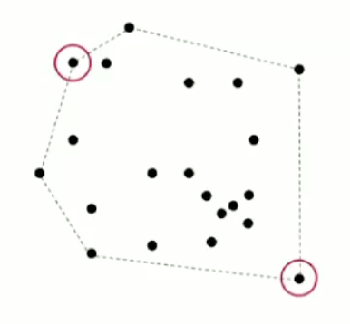

# 4.5 - Convex Hull

Finally in this lecture, we'll look at an application of sorting from the field of computation geometry.

The **complex hull** of a set of N points is the smallest perimiter fence which encloses those points. A number of equivalent mathematical definitions are:

* The smallest convex set containing all points
* The smallest area convex polygon enclosing all points.
* A convex polygon enclosing the points, whose vertices are points in the set.

We want the *output of our algorithm* to be the sequence of vertices in counterclockwise order.


It transpires that there is actually a way to calculate the complex hull mechanically: just hammer nails perpendicular to the plane at each point, and then stretch an elastic rubber band around the nails. The shape it comes to is the convex hull.

## Example applications

### Robot Motion Planning

An example application of this algorithm is in robot motion planning. If we want our robot to take the shortest path from point `s` to point `t`, when there is some kind of polygonal obstacle in the way, it turns out that the shortest path is either:
* The straight line from `s` to `t` (if it is not blocked)
* One of the two polygonal chains of the convex hull for the set of points `s`, `t` and the vertices of the obstacle.


### Farthest Pair

Another example case is, given N points on a plane, finding the pair of points with the largest Euclidean distance between them.

That pair of points will turn out to be the extreme points on the convex hull of the set of N points.



## Geometric Properties

There are a variety of geometric properties of the complex hull that we can use to help calculate it. (Note that we will not be proving any of these properties at the moment. Rest assured that there are proofs for all of them, we just don't want to delve into those details at the moment). Two we will utilise are:

1. We can traverse the complex hull by making only counterclockwise turns.
2. The vertices of the convex hull appear in increasing order of polar angle with respect to point p with the lowest y-coordinate.

These properties lead us to an algorithm we can use to calculate the convex hull.


## Graham Scan algorithm

Our algorithm is as follows:

1. Choose the point `p` with the smallest y-coordinate
2. Sort the points by their polar angle with `p`
3. Instantiate an index `j = 0`
4. For each point `j`, if the previous point in the proposed hull, `i`, does not form a counterclockwise turn, discard point `i`.
5. Repeat step 4 until either the points `j` and `i` form a counterclockwise turn, or you reach the point `p`
6. Increment `j`.
7. Repeat steps 4-6 until you have investigated all points.

### Implementation Challenges
1. How do we find the point p with the smallest y-coordinate?
   * One way is to define a total order, and compare the y-coordinates. (In laymans terms, sort the coordinates by their y-positions and choose the smallest). We'll look at this next lecture.
2. How do we sort the points by polar angle with respect to `p`?
   * Define a total order for each point `p`. We'll also look at this next lecture.
3. How do we determine whether `p1`->`p2`->`p3` is a counterclockwise turn?
   * This is a computational geometry problem that we'll look at shortly.
4. How do we sort efficiently?
   * Mergesort sorts in NlogN time.
5. How do we handle degenerecies (three or more points in a line)?
   * Requires care, but not hard in principle. The booksite contains more information.

### Counterclockwise turns

Given 3 points `a`, `b` and `c`, is `a`->`b`->`c` a counterclockwise turn?

2 points are worth noting:

1. We also have to deal with degenerecies, so this might not be quite as easy as it seems at first.
2. We also have to cope with floating-point precision.

The answer, it turns out, is to utilise the **determinant** (remember that?) of the points. The determinant gives double the *signed* area of the planar triangle.

* If that signed area is `> 0`, `a`->`b`->`c` is counterclockwise
* If that signed area is `< 0`, `a`->`b`->`c` is clockwise
* If that signed area is `== 0`, `a`->`b`->`c` are collinear

In code, this looks like:

```Java
public class Point2D {
  private final double x;
  private final double y;
  
  public Point2D(double x, double y) {
    this.x = x;
    this.y = y;
  }
  
  ...
    
    public static int ccw(Point2D a, Point2D b, Point2D c) {
    double area2 = (b.x-a.x)*(c.y-a.y) - (b.y-a.y)*(c.x-a.x);
    
    if      (area2 < 0) return -1; // clockwise
    else if (area2 > 0) return +1; // counter-clockwise
    else                return  0; // collinear
  }
}
```

## Graham Sort Code

The code for the Graham sort thus looks like:

```Java
Stack<Point2D> hull = new Stack<Point2D>();

Arrays.sort(p, Point2D.Y_ORDER); //p[0] has lowest y-coordinate
Arrays.sort(p, p[0].BY_POLAR_ORDER); //sort ny polar angle w.r.t. p[0] 

hull.push(p[0]);
hull.push(p[1]);

for (int i = 2; i < p.length; i++) {
  Point2D top = hull.pop();
  while (Point2D.ccw(hull.peek(); top; p[i]) <= 0)
    top = hull.pop();
  hull.push(top);
  hull.push(p[i]);
}
```

## Performance

We can see quite intuitively that the running time of this algorithm is NlogN for our sorting steps (hello Mergesort), and linear for the remainder.