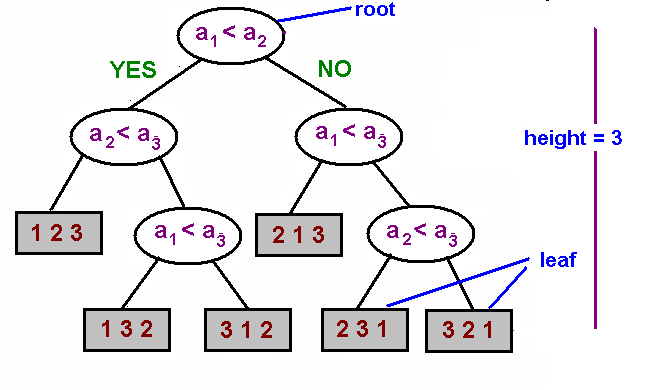

# 5.4 - Sorting Complexity

Mergesort affords us an excellent opportunity to look at the complexity of the sorting problem, and problems in general.

To review, computational complexity is a framework to study the efficiency of algorithms for solving a specific problem. To study the complexity of a specific problem, we need to establish several items, namely:
* **Model of Computation** - allowable operations.
* **Cost Model** - Operation Count.
* **Upper Bound** - Cost guarantee provided by *some* algorithm for X.
* **Lower bound** - Proven limit on the cost guarantee for *all* algorithms for X.
* **Optimal Algorithm** - Algorithm with best possible cost guarantee for X.

For example, taking the problem of sorting, we have:

* Model of Computation - decision tree (i.e. can only access information through compares)
* Cost Model - # compares
* Upper Bound - NlgN from mergesort
* Lower bound - ?
* Optimal Algorithm - ?

This decision tree model of computation also has a trivial lower bound of N (where we have to touch every item). However, as we shall see, we can actually show that the lower bound is higher than N. With this new lower bound, we will be able to prove that mergesort is actually the optimal algorithm for this model of computation.

## Calculating a new lower bound

The proposition we are trying to prove can be written as:

> Any compare-based sorting algorithm must use at least lg(N!) ~ NlgN compares in the worst case
> 
(The rough equivalence of lg(N!) and NlgN is provided by Stirling's approximation)

To prove this, we note the following facts about decision trees:
* The worst case number of comparisons for a decision tree is provided by the height of the decision tree
* The decision tree must contain a leaf for every possible ordering (otherwise, the algorithm cannot distinguish between potential orderings)

The image below demonstrates the above in the case of an array of 3 items. We can see that the tree has **6 leaves** to account for the 3! = 6 possible sorts, and takes **3 comparisons** in the worst case to determine the correct ordering.



Our proof goes as follows:

1. Assume an array consists of N distinct values, a1 to aN
2. A binary tree of height h can have at most 2^h leaves (if it is full)
3. There must be at least N! different orderings, which implies at least N! different leaves.
4. Therefore:
   ```
   2^h >= N!
   hlg2 >= lg(N!)
   hlg2 >= NlgN
   h >= NlgN
   ```
5. Thus, we can show that the lower bound for the worst-case complexity of the decision tree model of sorting algorithms is **NlgN**

## Complexity in Context

Plugging this back into our earlier analysis, we see:

* Model of Computation - decision tree (i.e. can only access information through compares)
* Cost Model - # compares
* Upper Bound - ~ NlgN from mergesort
* Lower bound - ~ NlgN
* Optimal Algorithm = Mergesort

As we already have an algorithm with the complexity of the lower bound, mergesort, we can see that it qualifies as an **optimal algorithm** for this problem.

However, be careful. We have proved **mergesort is optimal w.r.t. number of compares**. However, we also know that mergesort is **not optimal w.r.t. space usage**. Insertion sort uses less space than mergesort.

What we should do is use our theory here to guide our practice. There's no point in trying to design an algorithm which takes less time, because we've shown it can't be done.

However, if we change the parameters of our model of computation, say by providing the array with more information about the initial order of the input, the distribution of key values or the representation of keys, we might be able to do better. 
* Insertion sort for partially-sorted arrays is an example of this.
* We'll show that in the case of duplicates, we might not need NlgN compares. (3-way quicksort)
* We can also use digit/character compares instead of key compares for numbers and strings. (see radix sorts)

