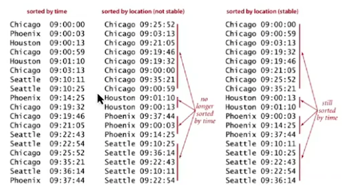

# 5.6 - Stability

We know will briefly discuss the fundamental topic of stability, using the Comparators we've just introduced as a base.

Let's say we want to sort a group of students by both their names, and their class (which for the purposes of this example will be denoted by an int), so that we get a list like:
Class | Name
1 | Andrew
1 | Dani
1 | Emily
2 | Amy
etc...

We might think the intuitive way to do this is to just sort by name, and then sort by class. The problem is that there's no guarantee that the students *within* a class will be sorted by name. The class sort does not retain that sort. i.e., we might get:

Class | Name
1 | Dani
1 | Emily
1 | Andrew
2 | Johanna
etc...

We call this retention of a sort **stability**. More technically:
> A **stable sort** is one which preserves the relative order of items with equal keys.
 
The following image illustrates this in the context of planes taking off from an airport:

## Stability of Sort Methods

A natural question then, is which of the sort methods we've discussed so far are stable?

The short answer is:
* **Stable** - insertion sort, mergesort
* **Not Stable** - selection sort, shellsort

**But** this is dependent on the specific code of an implementation.

In a little more detail:
* Insertion sort is stable because we never move equal items past each other.
* Selection sort is not stable because a long distance exchange can reasonable move an item past another equal item. E.g. in the sequence B1 B2 A -> A B2 B1
* Shellsort also has long distance exchanges, and so it isn't stable
* Mergesort is stable as long as the merge operation is stable, i.e. as long as, when the two keys are equal, you take from the left subarray.

