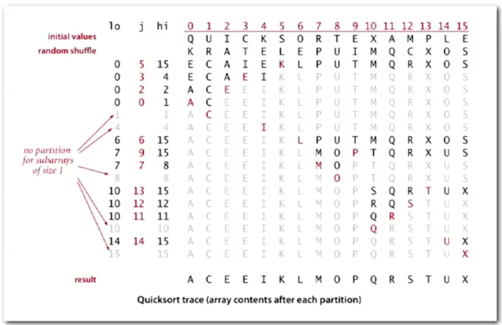
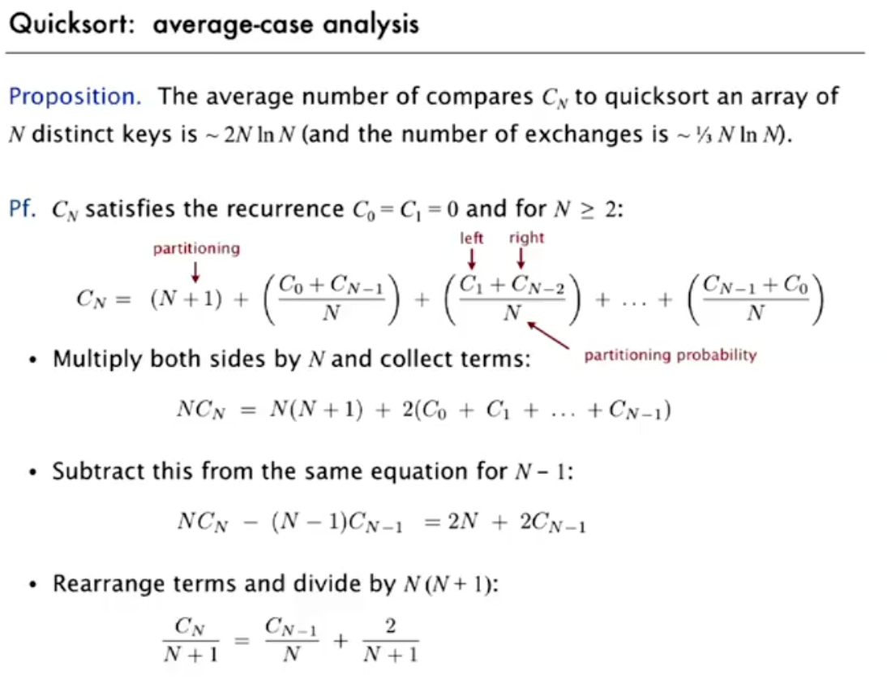
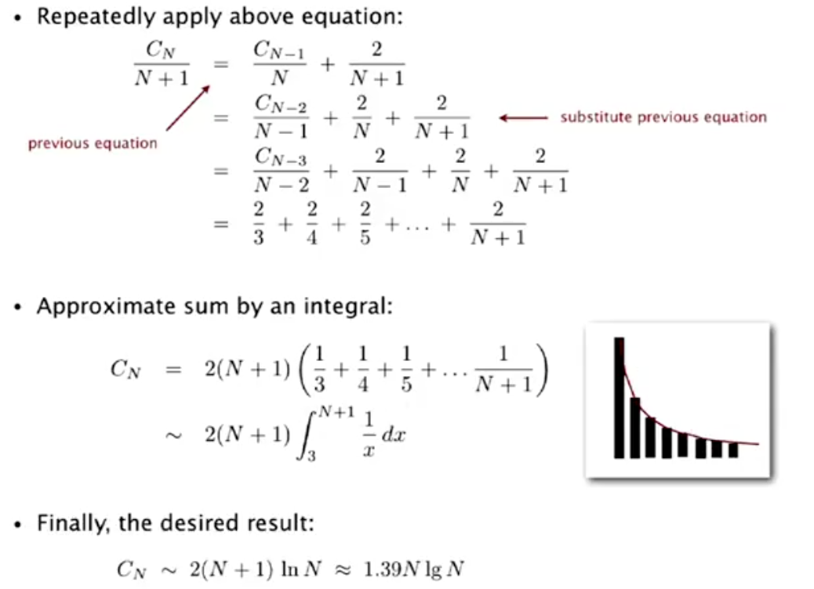

# 6.0 - Quicksort

Quicksort has been named as one of the most important algorithms of the 20th century. Thanks to a full scientific understanding of its properties, computer scientists have developed it into one of the most widespread and practical system sorts available today. Almost all programming languages implement it, and Java uses it as its sort for primitive types.

## Algorithm

The basic idea of the algorithm is:
1. Randomly shuffle the array
2. Partition it so that, for some `j`
   * entry `a[j]` is in place
   * there is no larger entry to the left of `j`
   * there is no smaller entry to the right of `j`
3. Sort each piece recursively

One key difference between this sort and mergesort is that in this step, we do the recursion *after* sorting, rather than before.

### Paritioning Implementation

We can implement Quicksort by repeating a few phases.

#### Phase 1

Phase 1 uses 3 pointers:
* Out first pointer (`lo`) points to our partition element. As we have sorted the array, we can simply choose the first element of the array to fulfill this function.
* Our second pointer (`i`) scans from left to right, as long as `a[i] < a[lo]`
* Our third pointer (`j`) scans from right to left, as long as `a[j] > a[lo]`.

If both the condition for moving `i`, and the condition for moving `j` are not met, than we swap `a[i]` and `a[j]`.

#### Phase 2

When the pointers `i` and `j` have crossed:
* Swap `a[lo]` with `a[j]`.

As, at that point, `j` will be pointing at the right-most element of the 'smaller' items partition, so by swapping it with `lo`, we've met the conditions in step 2 of the algorithm above.

### Full Code Implementation

```Java
public class Quick {
  public static void sort(Comparable[] a) {
    StdRandom.shuffle(a);
    sort(a, 0, a.length - 1);
  }
  
  private static void sort(Comporable[] a, int lo, int hi) {
    if (hi <= lo) break;
    int inPlace = partition(a, lo, hi);
    sort(a, lo, inPlace - 1);
    sort(a, inPlace + 1, hi);
  }
  
  private static int partition(Comparable[] a, int lo, int hi) {
    int i = lo;
    int j = hi;
  
    while (true) {
      while (less(a[++i], a[lo])) //find item on left to swap
        if (i == hi) break;
    
      while (less(a[lo], a[--j])) //find item on right to swap
        if (j == lo) break;
    
      if (i >= j) break; //check if pointers cross
      exch(a, i, j); //swap
    }
  
    exch(a, lo, j); //swap with partioning item.
    return j; // return index of item known to be in place
  }
}
```

An example trace of a quicksort in action is shown below:



## Implementation Details

### Partitioning in-place

Using an extra array makes partitioning easier (and stable), but is not worth the cost. One of Quicksort's biggest advantages over Mergesort is that it works in-place.

### Terminating the loop

Testing when the pointers cross is actually trickier than it seems. (Obviously, it seems easy when you've got all the working code to hand). But when implementing yourself, do be careful.

### Staying in bounds

The `(j == lo)` test is redundant, as the pointer `j` moves *towards* `lo` as it decreases, so if `a[lo]` is in fact the smallest item in the array, we'll eventually do the comparison `less(a[lo], a[lo])` which will return false and break us out of the while loop.

On the other hand, the `(i == hi)` test is necessary; the pointer `i` moves *away* from `lo`, so if `a[lo]` is the highest item in the array, `i` could potentially move beyond `hi`.

### Preserving Randomness

Shuffling is needed for performance gain. 

This is because Quicksort's worst-case time complexity comes when you use it on a sorted array, as the resulting subarrays are not of roughly equal size.

If we assume that the chances of being asked to sort an already sorted array are higher than the probability of a truly random array being perfectly sorted, than we increase can our performance by shuffling by reducing the likelihood we see the worst-case scenario.

### Equal Keys

When duplicate keys are present, it is (counter-intuitively) better to stop on keys equal to the partitioning key's item.

## Performance Analysis

### Empirical

If we conduct an empirical performance analysis, we see that, despite quicksort and mergesort both being O(NlgN), quicksort actually performs quite a bit better on large data sets. For N on the order of a billion, we see an approximately **33%** improvement (12m for Quicksort vs 18m for Mergesort on a Home PC doing 10^8 compares per second).

### Analytical - Best and Worst Cases

* Best Case - the partition divides the array into roughly equal halves at each step -> **~ NlgN**
* Worst Case - the array is already sorted, so each partition only removes one element from the base array -> **~ (N^2)/2**

### Analytical - Average Case

This is the most interesting case, and in the lecture we actually look at the mathematical derivation. Our proposition is that:

> The average number of compares C_N to quicksort an array of N distinct keys is ~ 2NlnN (and the number of exchanges is ~(NlnN)/3)
> 

The images below shows the math for this process worked out:




Thus, with the shuffle, we find that the worst case is incredibly unlikely. So our average sort case handles this difficulty. Interestingly, in comparing with mergesort, we find that:
* Quicksort does 39% *more* compares than mergesort
* **But** its faster in practice because you do less data movement.

### Caveats

Be careful with Quicksort. There are many implementations on the internet that inadvertantly can go quadratic for certain cases, including:
* Reversed or sorted arrays (e.g. if they don't include shuffling)
* Arrays with many duplicate items (see note 6.2)

## Summary

* Quicksort is an **in-place** sorting algorithm
* Depth of recursion takes logarithmic extra space with high probability. You can guarantee logarithmic depth by recurring on the smaller subarray before the larger subarray.
* Quicksort is **not stable**. Because of the shuffle.

## Improvements

### Insertion Sort for Small Arrays

In practice, Quicksort is our fastest sort, but even it has too many overheads for small arrays. So use insertion sort for arrays of less than about 10. Alternatively, simply ignore the arrays when their size is less than 10 and do a final insertion sort pass at the end. This leads to a ~10-20% performance improvement.

### Median of Sample

The best choice for a pivot item in our array is the median. We can estimate this by taking the median of a sample of 3 random items. Again, this slightly reduces the number of compares, and leads to a ~10% performance improvement.