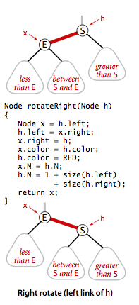

# 9.1 - Red-Black BSTs

Next up, we'll be looking at red-black BSTs, a data structure that lets us implement 2-3 trees with very little code beyond what is necessary to implement a regular BST. The specific variant we'll be implementing is called a **left-leaning red-black BST**.

The essential idea here is that we need some way to represent 3-nodes in our tree. The way we'll do this is by using "internal", left-leaning links as the "glue" for our 3-nodes. The larger of the 2 keys in 3-node will always be the "root" node, and the "internal" link will be called a "red" link, to distinguish it from regular, "black" links between nodes in the tree.


Thus, we can represent any 2-3 tree as a left-leaning red-black tree. In addition, if we represent the red links as "horizontal", we can see that the distance between the root and the null links is identical for every node in the tree:


## An Equivalent Definition

Rather than starting from the 2-3 tree, we can also define this red-black tree in terms of its properties. Thus, a left-leaning red-black tree is a BST such that:

1. No node has 2 red links connected to it.
2. Every path from the root to a null link has the same number of black links (called *perfect black balance*)
3. Red links lean left

## Search Implementation

One of the most interesting consequences of this definition is that the implementation of search (i.e. compare to node key, go left if node key is greater, go right if node key is less) is exactly the same for a red-black tree as it is for a regular BST. We can totally ignore the color of the links. The key difference is that because the red-black tree is balanced, it will take fewer comparisons. (We've implemented it here iteratively, rather than recursively, as in our earlier implementation).

```Java
public Val get(Key key) {
  Node x = root;
  while (x != null) {
    int cmp = key.compareTo(x.key);
    if      (cmp < 0) x = x.left;
    else if (cmp > 0) x = x.right;
    else              return x.val;
  }
  return null;
}
```

Indeed, most of the other operations we implemented in BSTs (e.g. ceiling, selection), are also identical. The only operations we do need to be careful of are ones which add (or remove) elements from the tree. As long as we maintain the properties of the red-black tree in these. We'll be fine.

## Red-Black BST representation

We do, of course need some way to determine whether a link is red or black. The easiest way to do this is with a boolean flag. By noting that each node can only have one parent, we can insert this flag into the definition of the `Node` class. In code:

```Java
private static final boolean RED   = true;
private static final boolean BLACK = false;

private class Node {
  Key key;
  Value val;
  Node left, right;
  boolean color; // color of parent link
}

private boolean isRed(Node x) {
  if (x == null) return false; // null links are black
  return x.color == RED
}
```

## Elementary Red-Black BST Operations

There are a couple of elementary operations we need to perform on red-black trees, specifically left and right rotations, and the color flip.

### Left Rotation

The idea of this operation is to orient a (temporarily) right-leaning red link to instead lean left. Doing this is just a matter of moving around the links between nodes:


The important property of this rotation is that it maintains both symmetric order and perfect black balance.

### Right Rotation

Strangely enough, we will also need the mirror of the above operation, `rotateRight`, to temporarily make some left-leaning links lean right. We'll see how and why that's necessary shortly.



This of course also maintains the operations.

### Color Flip

The third operation we'll need to perform is called a color flip. It's possible during the course of our work that we end up with a node which has 2 red links as its children, and a black link to its parent. Indeed, this is precisely the scenario that occurs when we have a temporary 4-node.

Luckily, resolving this issue is trivial. We simply invert the color of all three links coming out of the node in question. Both its child links become black, and its link to its parent becomes red. In the language of 2-3 trees, this is identical to breaking up a temporary 4-node into 2 2-nodes with a 3-node as its parent.


As is obvious from the diagram, because no links have changed, symmetric order and perfect black balance are maintained.

## Insertion in a Left-Leaning Red-Black (LLRB) tree

We can use these operations to implement insertion in our LLRB tree. We'll do this by considering a range of possible scenarios.

### Inserting into a tree with exactly one node

If this is a **left** insertion (i.e. the inserted key is less than the root key):
* Simply add it as a child with a **red** link to its parent.

If this is a **right** insertion (i.e. the inserted key is greater than the root key):
* Add it as a red child as above, and then perform a **left rotation** on the root node.


### Inserting into a 2-node at the bottom of the tree

This process is essentially identical to the case with just one node. We just:
* Do a standard BST insert, while coloring the new link red
* If the new red link is a right link, rotate left.

### Inserting into a tree with exactly two nodes (i.e. a single 3-node)

There are 3 cases here. They correspond to:

* Case 1 - the new node is the **greatest** node in the tree
* Case 2 - the new node is the **smallest** node in the tree
* Case 3 - the new node is the **middle** node in the tree

#### Case 1 - New node is greatest

In this case, the node gets added as the right child of the root node. This creates a temporary 4-node with the 3 nodes, and so we just do a color flip to maintain our perfect black balance.

#### Case 2 - New node is smallest

In this case, the node gets inserted as the left link of the child node in the tree. When this happens, we have **two red nodes in a row**. To resolve this we:
1. Rotate the root node to the right (which gives us a set up identical to Case 1)
2. Perform a color flip

#### Case 3 - New node is middle

In this case, the node gets added as the right link of the child node. When this happens, we again have two red links in a row, but in a different configuration to Case 2. To solve this:
1. Rotate the center node to the left (which gives us a setup identical to Case 2)
2. Rotate the root node right
3. Perform a color flip


### Inserting into a 3-node at the bottom

This is solved by simply generalising the case of inserting into a tree with two nodes. To insert into a 3-node at the bottom, all we do is:

1. Do a standard BST insert, coloring the new link red
2. Rotate (i.e. either a right-rotation, or a left rotation then a right rotation) to balance the bottom-most 4-node (if necessary)
3. Flip the colors to pass the red link up one level
4. Rotate to make the tree lean left (if necessary)


### Inserting into an LLRB tree: Passing red links up a tree

We can do a general insertion by repeating our 2-insertion or our 3-insertion as necessary while passing the red link up the tree. For example:


### Generalising insertion

All the cases we've described above can be handled by simply re-applying the same 3 if-else operations:

* *Right child red, left child black* - rotate left
* *Left child red, left-left-grandchild red* - rotate right
* *Both children red* - flip colors

```Java
private Node put(Node h, Key key, Value val) {
  if (h == null) return new Node(key, val, RED); //insert at bottom
  int cmp = key.compareTo(h.key);
  if      (cmp < 0) h.left  = put(h.left,  key, val);
  else if (cmp > 0) h.right = put(h.right, key, val);
  else              h.val = val;
  
  if (isRed(h.right) && !isRed(h.left))     h = rotateLeft(h);  // lean left
  if (isRed(h.left)  && isRed(h.left.left)) h = rotateRight(h); // balance 4-node
  if (isRed(h.left)  && isRed(h.right))     flipColors(h);      // split 4-node
  
  return h;
}
```

## Balance in LLRB trees

We can easily prove that the **height of the tree <= 2 lg N**. The proof is just:

* Every path from root to null has the same number of black links
* You never have two red links in a row

In typical applications, the height of the tree is ~ 1.0 lg N

While we haven't covered deletion at all, it has the same performance as insertion and searching.