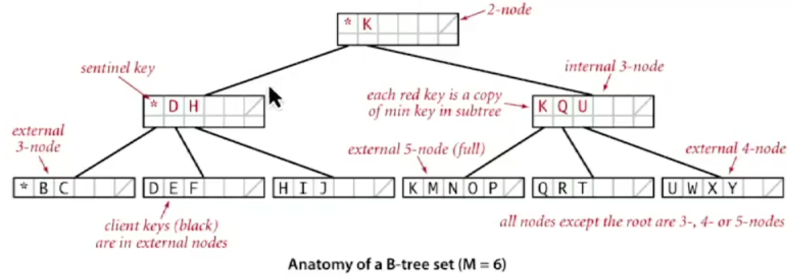
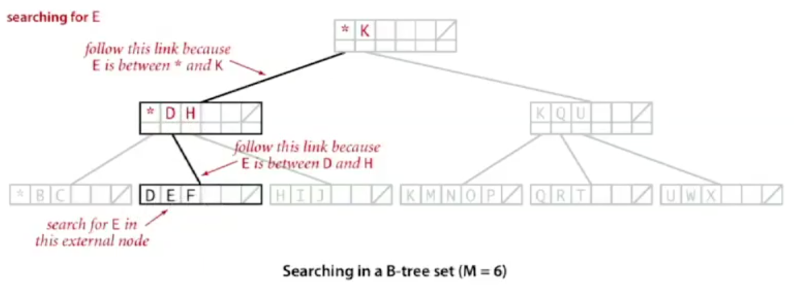
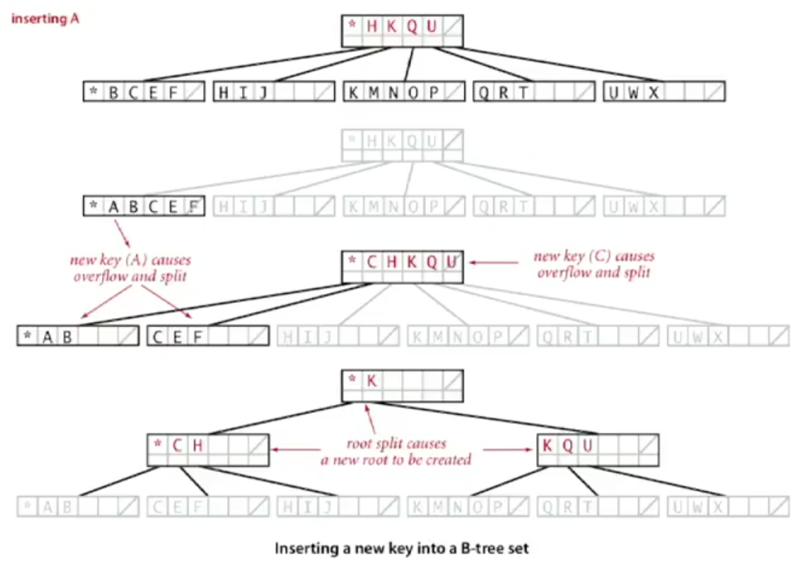

# 9.2 - B-Trees

In the final section of this lecture, we'll look at B-trees, which are a generalisation of the previous work. We'll also look at some practical implementations.

## The File System model

To introduce B-trees, we need to recognise that the data we're trying to store is often really large. To emphasise this, we can think of the file system model.

In this model we have a few terms to define:
* A **Page** is a contiguous block of data (e.g. a file or a 4096-byte chunk).
* A **Probe** is the first access to a page.

The reason that this is called the file-system model is that this analogous to memory management in a computer. Your computer's hard disk stores large amounts of data, but it is very slow to access. However, after the probe has been completed, the data accessed can be dumped in local memory (RAM), and so accessing data within the page can be very fast.

With that image in mind, we can note the property, that:

> The time required for a probe is much larger than the time to access data within a page.

Thus:
* Our **cost model** is the number of probes
* Our **goal** is to access data using the minimum number of probes.

B-trees are a generalisation of balanced trees that allow us to solve the problem presented in this model

## B-trees

B-trees generalise 2-3 trees by allowing up to `M - 1` key-link pairs per node. `M` is chosen to be as large as possible so that M links fit in a page. e.g. M = 1024.

Additionally:
* There are at least two key-link pairs at the root
* At least M/2 key link pairs in other nodes
* External nodes (i.e. nodes at the end of the tree) contain client keys (i.e. the data)
* Internal nodes (i.e. not external nodes) contain copies of keys to guide search

Typically, B-trees are set up so that all the data is stored in the external nodes, and those nodes are in sorted order. 

The internal nodes then contain copies of the nodes below them so that you can determine what interval of data the nodes below contain. E.g. in the diagram the root node contains the sentinal node (\*, which just indicates the start of the keys) and the node K, which means that nodes up to but not including K are in the left child, and nodes with key K or greater are in the right child.

Inserting into a full node splits it in an analogous way to how 3-nodes split when you add data to them in a 2-3 tree.

## Searching in a B-tree

To search a B-tree, you:
* Start at the root node.
* Find the interval for search key and take the corresponding link
* Search terminates when you hit an external node.

## Insertion in a B-tree

To insert into a B-tree, you:
* Search for the new key
* Insert at the bottom
* Split nodes with `M` key-link pairs on the way up the tree.

## Balance in B-tree

Analysing thi, we come to the conclusion that a search or an insertion into a B-tree of order `M` with `N` keys requires between `log_{M-1}(N)` and `log_{M/2}(N)` probes.

The proof of this fact is simply that all internal nodes, other than the root, have between M/2 and M-1 links

In practice, the number of nodes is at most 4 or 5. A value of M=1024 would allow us to store literally trillions of keys.

We can optimize this algorithm by always keeping the root page in memory.

## Balanced trees in the wild

**Red-black trees** are widely used as system symbol tables. Some applications include:
* Java: `java.util.TreeMap`, `java.util.TreeSet`
* C++ STL (Standard Template Library): map, multimap, multiset
* Linux kernel: completely fair scheduler, `linux/rbtree.h`
* Emacs: conservative stack scanning

**B-trees and variants** (e.g. B+ tree, B* tree, B# tree, etc...) are widely used for file systems and databases. Uses include:
* Windows: NTFS
* Mac: HFS, HFS+
* Linux: ReiserFS, XFS, Ext3FS, JFS
* Databases: ORACLE DB2, INGREST, SQL, PostgreSQL

Red-black trees even get a mention in populat culture. The Canadian TV series missing contains the following bit of dialog, which is too wonderfully awkward not to quote:

> **Jess**: "It was the red door again."
> **Pollock**: "I thought the red door was the storage container."
> **Jess**: "But it wasn't red anymore, it was black."
> **Antonio**: "So red turning to black means what?"
> **Pollock**: "Budget deficits, red ink, black ink."
> **Antonio**: "It could be from a binary search tree. The red-black tree tracks every simple path from a node to a descendant leaf that has the same number of black nodes."
> **Jess**: "Does that help you with the ladies?"